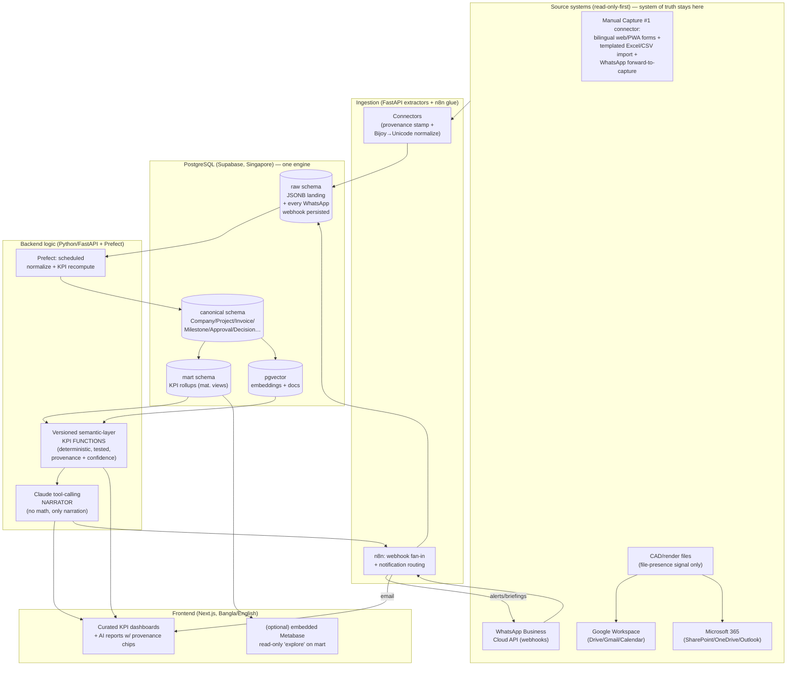
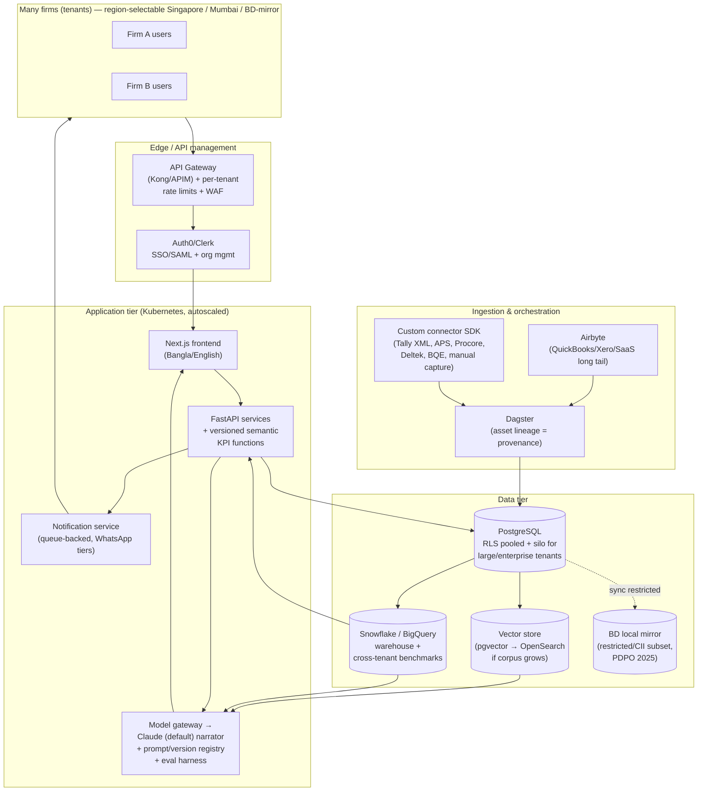

# Technical Architecture & Stack Recommendation

> PracticeLens — the AI reporting & analytics layer above a Dhaka architecture firm's existing (mostly informal) tools. This section picks a concrete, named stack for all 18 layers, compares the candidate options head-to-head, and gives **one MVP stack** (single-firm pilot, ~6 months, funded small team) and **one target multi-tenant SaaS architecture**. Currency is **BDT** unless a foreign-client/USD case applies. Every choice is justified against four constraints the rest of the blueprint has already fixed: (1) the highest-value data is *missing/informal* (no timesheets, verbal approvals, WhatsApp scope changes) so **manual capture is a first-class connector**; (2) **read-only-first, source-stays-truth, provenance on every record**; (3) **anti-hallucination — the LLM never computes a number, only narrates deterministic SQL/semantic-layer output**; (4) **multi-tenant-ready from day one, but the pilot is single-tenant.**

## The decisions that drive everything below

Three architectural commitments collapse most of the 18-layer decision space before we start comparing vendors:

1. **One Postgres for OLTP + analytics in the MVP. No separate warehouse yet.** A 5–30 staff firm produces *kilobytes-to-megabytes* of structured practice data per month, not terabytes. The KPI math (`Fee Burn Rate`, `EAC`, `Invoice Aging`, `Schedule Variance`, `Collection Rate`) is small-N aggregation over thousands of rows, not billions. Standing up Snowflake/BigQuery for the pilot is resume-driven over-engineering that adds cost, a second copy of the data, and an ETL hop we don't need. We use **one PostgreSQL instance** with a clean separation between *raw landing*, *canonical*, and *semantic/mart* schemas. We graduate to a real warehouse only when multi-tenant volume or cross-tenant benchmarking demands it (target architecture below).

2. **The semantic layer is application code, not a BI tool's modelling layer.** Because anti-hallucination requires that *every number be a versioned, testable, deterministic function with provenance*, the KPI definitions live in our backend as version-tagged SQL/Python functions (the "semantic-layer functions" the AI section depends on), not buried inside Power BI measures or a Superset dataset. This is the single most important structural decision and it disqualifies "just point Power BI at the DB" as the product.

3. **Claude is the AI layer, used strictly as a tool-calling narrator over those functions.** Justification is its own section at the end — but it means the AI layer is an SDK + orchestration concern, not a model-hosting concern.

---

## Layer-by-layer comparison of the named options

### Database / system of record

| Option | Strengths | Weaknesses for our case | Recommendation |
|---|---|---|---|
| **PostgreSQL (managed)** | OLTP + analytical aggregation in one engine; JSONB for raw landing payloads (WhatsApp webhooks, thin webhook bodies); `pgvector` for embeddings (no separate vector DB); rich SQL for deterministic KPI functions; row-level security (RLS) for multi-tenant; cheap; portable across Singapore/Mumbai regions and any cloud | Not a columnar warehouse — will not scale to cross-tenant TB analytics (a *later* problem) | **PRIMARY — MVP and core OLTP at scale.** Everything starts here. |
| **Supabase** | Managed Postgres + Auth + storage + auto REST/Realtime + RLS, in **ap-southeast-1 (Singapore)**; collapses ~4 layers into one platform; massive build-speed win for a small team | Opinionated; some lock-in to its Auth/Realtime; not in Mumbai (Singapore only of our two regions) | **MVP database + auth + storage host.** Use it as managed Postgres, not as a framework cage. |
| **Azure SQL** | Strong if the firm were M365/Azure-centric; **Central India (Pune)/Chennai/Singapore** regions available; good compliance posture | T-SQL not Postgres; weaker JSON/vector story; no reason to leave the Postgres ecosystem; pricier at small scale | **No** (unless a future enterprise tenant mandates Azure residency). |
| **Snowflake** | Best-in-class multi-tenant columnar analytics, separation of storage/compute, data sharing for benchmarking | Overkill + cost for pilot data volumes; USD billing friction from Bangladesh; second copy of data; another ETL hop | **Target tier only** — the analytics warehouse when multi-tenant. |
| **BigQuery** | Serverless, cheap-at-rest, great for large append-only event analytics; Mumbai/Singapore regions | Same "no warehouse needed yet" argument; GCP-centric; streaming-insert cost model | **Target-tier alternative** to Snowflake; pick on cloud allegiance. |

### Frontend

| Option | Verdict |
|---|---|
| **Custom React (Next.js + TypeScript)** | **RECOMMENDED.** The product *is* a bespoke bilingual dashboard + manual-capture forms + AI report views with inline provenance chips and "insufficient data" states — none of that is an off-the-shelf BI screen. React + Next.js gives SSR for fast first paint on Dhaka networks, mature i18n (`next-intl`), a huge component ecosystem, and the same codebase can wrap to mobile via PWA/Capacitor for site-report capture. |
| Power BI / Metabase / Superset as the UI | Rejected as the *primary* UI — see build-vs-buy below. Embedded BI can sit *inside* the React shell for power-user ad-hoc exploration, but it cannot be the manual-capture + AI-narration product. |

### Prototype vs. production frontend — Vite now, Next.js for the build

> **Decision (recorded):** the client-facing **pilot prototype** (the SPACE ESSE demo in `app/`) is built on **Vite + React + TypeScript**, deployed as a static SPA. The **production** frontend should adopt **Next.js** (as recommended above) once a real backend lands. Both are React on the same component library and design system, so this is a swap, not a rewrite.

**Why the prototype is Vite, not Next.js**
- It is **frontend-only with mock data** — no server, no API routes, no SSR data fetching — so Next.js's defining strengths (server components, SSR/SSG, API routes, middleware, server-side auth) would sit unused.
- It is **dashboard-heavy and fully client-rendered** (Recharts, command palette, filters, AI assistant panel). SSR would add hydration boundaries and `"use client"` overhead for zero benefit, plus the usual chart/Radix SSR friction.
- It ships as a **pure static `dist/`** — trivially hostable (Vercel/Netlify/S3+CDN), cheap, no Node runtime — ideal for a shareable first-impression demo.
- **Lower risk / faster:** React 18 + Vite + Recharts + Radix "just work" with minimal config and instant HMR.

**When to move to Next.js (the trigger):** when building the production SaaS that needs a real backend — server-side auth/sessions, API routes or server actions, RBAC enforced on the server, server components fetching the semantic-layer KPIs, server-side PDF/report generation, edge middleware, and any marketing/SEO surface. At that point Next.js (or Remix) is the right call and matches the recommendation above.

**Why migration is low-friction**
- The prototype is plain **React + React Router** — components, design system and pages port directly.
- The data layer is already **abstracted behind `app/src/lib/api.ts`**: every read flows through one `resolve()` returning promises (consumed via TanStack Query). Swapping `resolve()` for `fetch`/server calls is the bulk of the work; the UI is untouched.
- You mainly re-map routing (React Router → Next's router) and add the server/data layer. **Same host (Vercel) — no lock-in.**

Read **Next.js** in the "MVP RECOMMENDED" rows below as the *production* target; the *pilot demo* intentionally runs on Vite for speed and a zero-backend static deploy.

### Analytics / dashboard visualization (build vs buy)

| Option | Strengths | Weaknesses | Recommendation |
|---|---|---|---|
| **Custom React charts (Recharts / visx / ECharts)** | Full control of look, bilingual labels, provenance chips on every figure, "data missing" empty-states, anti-hallucination affordances; no per-viewer licensing | We build interactions | **MVP RECOMMENDED for the curated KPI dashboards** (the dashboards spec is fixed and finite — build them). |
| **Metabase** | Open-source, self-host, cheap, fast to stand up, good for ad-hoc SQL questions; embeddable | Its models bypass our versioned semantic functions → anti-hallucination risk if it becomes the source of truth | **Optional embedded "explore" surface for Finance/Owner power users, read-only, fed from the *mart* schema only.** Not the product. |
| **Superset** | Powerful, open-source, rich viz | Heavier ops burden than Metabase for a small team; same semantic-bypass risk | **No** for MVP (ops cost > Metabase). |
| **Power BI** | Best embedded analytics + Bangla report rendering if firm is M365-heavy; Power BI Embedded for SaaS | Per-capacity USD cost, Microsoft lock-in, governance overhead; overkill at pilot scale | **Target-tier option** for an embedded self-service add-on; not MVP. |

**Build-vs-buy ruling:** **Build the curated dashboards and AI report surfaces in React; optionally *buy/embed* Metabase as a contained "ad-hoc explore" tab.** The curated KPI views and AI narratives are the differentiated product and must show provenance + confidence + refusal states that no BI tool models natively — those are built. Generic "let a power user slice a table" is undifferentiated commodity — that we embed rather than build, fed strictly from the read-only `mart` schema so it can never contradict the versioned KPI functions.

### Backend

| Option | Verdict |
|---|---|
| **Python + FastAPI** | **RECOMMENDED.** The center of gravity is data work: ETL/normalization, the deterministic **semantic-layer KPI functions**, Bengali text handling (Bijoy↔Unicode), OCR pipelines, and the **Claude tool-calling orchestration** (best SDK + ecosystem in Python). FastAPI gives async I/O for connector polling/webhooks, Pydantic for the strict typed contracts our anti-hallucination layer needs, and OpenAPI generation for the frontend. One language for API + data + AI keeps a small team fast. |
| Node.js | Fine for the API and great for realtime/webhooks, but it splits the stack — the KPI/AI/data code wants Python regardless, so two runtimes adds cost. Use Node only if the team is Node-native; otherwise consolidate on Python. |

### ETL / connectors

| Option | Strengths | Weaknesses | Recommendation |
|---|---|---|---|
| **Airbyte** | 300+ prebuilt connectors (Google Workspace, Microsoft, QuickBooks, Xero); managed or self-host; handles incremental/CDC | Heavy for the *handful* of MVP sources; connectors are generic, not provenance-aware; our hardest sources (WhatsApp persistence, Tally XML, manual capture) have **no** Airbyte connector | **Later/opportunistic** — useful when productization adds many SaaS finance sources. Not MVP. |
| **Dagster** | Asset-based orchestration, strong data-lineage model (fits provenance!), great typing/testing, observability | Learning curve; more than the MVP needs | **Target-tier orchestrator** — its asset-lineage model is the right home for provenance once pipelines multiply. |
| **Prefect** | Lightweight Python-native orchestration, easy to adopt, dynamic flows, good retries | Less lineage-native than Dagster | **MVP RECOMMENDED orchestrator** — schedules connector pulls, normalization, KPI recompute; minimal ceremony for a small team. |
| **n8n** | Low-code, visual, self-hostable; fast to wire Google/Microsoft/webhook flows and notifications; non-engineers can edit | Not for heavy typed transforms or the KPI math | **MVP RECOMMENDED for connector glue + notification routing** (the WhatsApp/email/calendar webhook fan-in, alert delivery), *paired with* Prefect for the typed data jobs. |

**ETL ruling:** the MVP doesn't have a generic-connector problem (Airbyte's sweet spot); it has a *few bespoke sources* problem. So: **custom FastAPI/Python extractors for the 6 MVP sources + n8n for low-code webhook/notification glue + Prefect to schedule and retry the typed normalization/KPI jobs.** Defer Airbyte to productization; adopt Dagster when lineage complexity justifies it.

### AI models

| Option | Verdict |
|---|---|
| **Claude (Anthropic)** | **RECOMMENDED for the reasoning/narration layer** — see dedicated justification below (anti-hallucination tool-use discipline, large context, strong instruction-following on "refuse when data is missing"). |
| **OpenAI (GPT)** | Strong, comparable tool-use; viable fallback/secondary. We keep the model layer behind an interface so a tenant or cost event can swap providers, but Claude is the default. |
| **Embeddings** | Provider-agnostic (OpenAI `text-embedding-3` or Voyage/Cohere multilingual for better Bangla) — embeddings are a separate, cheap, swappable choice from the chat model and **must be multilingual** for bilingual document search. |

### Document search & vector search

| Concern | MVP choice | Why |
|---|---|---|
| **Vector search** | **`pgvector` inside the same PostgreSQL** | Avoids a second datastore; volumes are tiny; keeps embeddings co-located with the canonical records they cite (provenance-friendly). |
| **Document search (keyword/bilingual)** | **Postgres full-text + trigram** for English; bundle the right Bengali handling | Hybrid keyword+vector retrieval; Bengali needs Unicode normalization + careful tokenization (no reliable Postgres Bengali stemmer — rely on trigram + embeddings). |
| **Scale-up** | OpenSearch/Elastic or a managed vector DB only if corpus grows | Target tier; not before evidence of need. |

### Auth

| Option | Verdict |
|---|---|
| **Supabase Auth (MVP)** | **RECOMMENDED for pilot.** Email/OTP + Google/Microsoft OAuth (the firm lives in both Workspace and M365), JWT, and **Postgres RLS** that we will reuse verbatim as the multi-tenant isolation boundary. Free at pilot scale. |
| **Auth0 / Clerk (target)** | Adopt at productization for enterprise SSO/SAML, org management, and per-tenant identity. Keep auth behind an interface so the swap is contained. |

---

## Recommended MVP stack (single-firm pilot, Dhaka)

Concrete, named, and chosen for **cost, hosting region (Singapore), Bangla/English i18n, and build speed** for a funded small team.

| Layer | MVP choice | Region / notes | Rough monthly cost |
|---|---|---|---|
| **1. Frontend** | Next.js + TypeScript + Tailwind; `next-intl` for **Bangla/English** i18n; bundled **Nikosh** Unicode Bengali font for in-app + PDF | PWA for site/manual capture on phones | Vercel/Render hobby→pro ~$20–40 |
| **2. Backend** | **Python + FastAPI**, Pydantic-typed contracts; houses the **versioned semantic-layer KPI functions** | Container on Render/Fly.io **Singapore** | ~$25–60 |
| **3. Auth** | **Supabase Auth** (Google + Microsoft OAuth, OTP), MVP RBAC roles: **Company Owner, Project Director/Manager, Project Architect, Finance/Admin**; finance data gated to Owner+Finance via **RLS** | — | incl. below |
| **4. Database** | **Supabase PostgreSQL** (ap-southeast-1 **Singapore**), schemas: `raw` (JSONB landing) → `canonical` (entities) → `mart` (KPI marts); RLS on a `company_id` from day one | Singapore | Pro ~$25 + usage |
| **5. Analytics warehouse** | **None — Postgres `mart` schema.** Materialized views / scheduled tables for KPI rollups | Defer warehouse | $0 |
| **6. ETL** | **Custom FastAPI/Python extractors** for the 6 MVP sources (templated Excel/CSV, Google, Microsoft, email/calendar, manual capture, WhatsApp-persist) | Read-only-first; provenance stamped on ingest | incl. backend |
| **7. Workflow automation** | **n8n (self-host)** for webhook fan-in + notification routing; **Prefect** for typed normalization/KPI-recompute schedules | Singapore container | ~$15–30 |
| **8. API management** | FastAPI + OpenAPI; a lightweight gateway (Traefik/Caddy) for TLS/rate-limit; secrets in Doppler/SSM | — | ~$0–10 |
| **9. AI models** | **Claude** via Anthropic SDK (tool-calling narrator) + multilingual embeddings (Voyage/Cohere) for Bangla docs | Behind a provider interface | usage ~$50–300 |
| **10. Document search** | Postgres full-text + trigram (hybrid with vectors) | bilingual normalization | incl. DB |
| **11. Vector search** | **`pgvector`** in the same Postgres | — | incl. DB |
| **12. Dashboard viz** | **Custom React (Recharts/ECharts)** for curated KPI dashboards + AI report views with provenance chips; optional embedded **Metabase** "explore" tab on `mart` (read-only) | — | $0 (self-host Metabase) |
| **13. Notifications** | n8n → email (Resend/SES) + **WhatsApp Business Cloud API** (the firm's primary channel) for alerts/briefings; in-app push (PWA) | persist every raw WhatsApp webhook before processing | ~$10–30 |
| **14. Logging** | Structured JSON logs → Grafana Loki (or Better Stack) | include calc-version + source IDs in every KPI log line | ~$0–20 |
| **15. Monitoring** | **Sentry** (errors) + Uptime + Grafana/Prometheus or Better Stack | alert on connector-sync failures & token expiry | ~$0–26 |
| **16. Hosting** | **Render or Fly.io, Singapore region** (managed, fast for a small team); Supabase = DB/Auth/Storage | Singapore = best service breadth of our two regions | rolled up above |
| **17. Backup** | Supabase PITR + nightly `pg_dump` to object storage (cross-region copy); documented restore drill | retention per data-minimization policy | ~$5–15 |
| **18. Security** | TLS everywhere; **Postgres RLS** tenant/role isolation; encryption at rest (Supabase) + column-level for sensitive identifiers (NID/TIN/passport); secrets manager; **data minimization** (don't ingest sensitive IDs we don't need); full **AuditLog** | **PDPO 2025** posture (see note) | incl. |

**All-in pilot infra: roughly USD $150–500/month** (excluding Claude usage, which scales with report volume — a 5–30 person firm's batch briefings/weekly reports land at the low end). This is deliberately frugal: the build cost is engineering time, not infrastructure.

### Region, billing, and PDPO note (Dhaka realities)
- **Region: Singapore (ap-southeast-1).** Mumbai is marginally lower-latency to Dhaka, but Singapore has the broadest service availability across Supabase/Render/Fly and is the pragmatic default. Keep region a config value so a tenant can demand Mumbai.
- **Billing friction:** paying these USD vendors from a Bangladesh entity is hard (Stripe unavailable in BD, forex controls). Route cloud spend through the startup's **offshore entity / international card**; collect pilot fees locally via **bKash/SSLCOMMERZ** in BDT.
- **PDPO 2025 (enacted, not draft):** ordinary firm/project data may be hosted in Singapore, but **sensitive identifiers (NID, TIN, passport, biometric) trigger cross-border-transfer approval** — so **minimize/segregate them**, and design a **Bangladesh local-mirror option** as a config switch for the subset that may be "restricted/CII." Enforcement ~May 2027 gives runway, but the data model must segregate sensitive fields now.
- **i18n is a data concern, not just a UI toggle:** store names/addresses in **both scripts**, normalize all input to **UTF-8**, detect+convert legacy **Bijoy/ANSI → Unicode** on import, and render PDFs/reports with bundled **Nikosh** so Bengali isn't garbled on the owner's machine.

### MVP architecture diagram

---

## Target architecture (multi-tenant SaaS, productization)

What changes when one firm becomes many — and richer-market tenants bring real API sources (Tally, QuickBooks/Xero, Autodesk APS, Procore, Deltek, BQE). The MVP was deliberately built so this is an *evolution*, not a rewrite: the canonical model, semantic functions, RLS, and Claude orchestration all carry forward.

| Layer | MVP | Target | What changes & why |
|---|---|---|---|
| **DB** | Single Supabase Postgres, RLS by `company_id` | **Postgres (managed, e.g. RDS/Cloud SQL) with RLS pooled tenancy**, sharded/silo for large tenants | Same isolation model scaled; large/enterprise tenants get dedicated schemas or DBs for PDPO local-mirror needs. |
| **Analytics warehouse** | `mart` schema | **Snowflake or BigQuery** (Singapore/Mumbai) | Now a real warehouse: cross-tenant benchmarking (e.g. anonymized `Utilization Rate` / `Forecast Project Margin` percentiles), heavy historical analytics, separation of OLTP from OLAP. |
| **ETL** | Custom extractors + n8n + Prefect | **+ Airbyte for the long tail of SaaS finance connectors; Dagster for asset-lineage** | Airbyte absorbs QuickBooks/Xero/etc.; Dagster's asset graph becomes the canonical home of **provenance lineage** across many tenants/sources. |
| **Connectors** | 6 sources | **+ pluggable API connectors:** Tally XML, QuickBooks, Xero, Autodesk APS, Procore, Newforma, Deltek, BQE, Bluebeam | Connector SDK + per-tenant credential vault; opportunistic by market. |
| **Auth** | Supabase Auth | **Auth0/Clerk** with SAML/SSO, org management | Enterprise identity, per-tenant IdP. |
| **AI** | Claude SDK direct | **Claude behind a model gateway** + prompt/version registry, per-tenant token budgets, eval harness | Cost control, A/B of providers, regression tests on anti-hallucination behavior. |
| **API mgmt** | FastAPI + Caddy | **API gateway (Kong/APIM)** + per-tenant rate limits + public connector webhooks | Manage tenant fan-out, partner APIs. |
| **Hosting** | Render/Fly Singapore | **Kubernetes (EKS/GKE) multi-region Singapore + Mumbai**, autoscaling | Scale, regional residency, BD local-mirror node for restricted data. |
| **Notifications** | n8n + WhatsApp/email | **Dedicated service** (queue-backed, per-tenant templates, WhatsApp tier management) | Reliable delivery, WhatsApp messaging-tier handling. |
| **Observability** | Sentry + Loki/Grafana | **+ per-tenant SLOs, data-freshness & Data Completeness dashboards, connector-health board** | Operate dozens of tenants' pipelines. |
| **Backup/Sec** | PITR + pg_dump | **+ per-tenant encryption keys, DPA/consent ledger, cross-border-transfer controls, SOC2 path** | PDPO 2025 sensitive-data controls; enterprise trust. |

### Target architecture diagram

---

## Why Claude for the AI layer

The AI layer's job is narrowly and deliberately defined in the AI Reporting section: **the LLM never computes a number and never queries the database — it decides which deterministic semantic-layer functions to call, reads their structured output, and writes the narrative around facts it was handed, with provenance and a `Data Completeness Score`, refusing when data is missing.** That job description selects the model:

1. **Tool-use discipline is the whole product, and Claude is strong at it.** Our anti-hallucination guarantee depends on the model reliably (a) calling the right KPI function, (b) *not* inventing numbers between calls, and (c) honoring "if `Data Completeness Score` < threshold, refuse and tell the owner what to capture." Claude's tool-calling and its strong instruction-following on negative constraints ("do not fabricate; cite or refuse") make that contract enforceable. For a Dhaka owner who is — correctly — skeptical of "AI" inventing his cash position, this is the difference between adoption and abandonment.

2. **Large context fits the messy, bilingual, sprawling evidence.** A single weekly project report or scope-creep detection may need many `IntegrationRecord`s, captured WhatsApp/email snippets, `Decision`/`Approval`/`Change` rows, and prior reports — mixed Bangla/English — passed in alongside the function outputs so the narrative is grounded in *cited source text*. Claude's large context window lets us hand it the full evidence set with citations rather than aggressively pre-summarizing (which would itself risk dropping or distorting facts).

3. **Strong refusal/guardrail behavior matches "refuse when data is missing."** The most dangerous failure here is confident prose over absent timesheets or verbal approvals. Claude's tendency to follow explicit "say you don't know" instructions, plus structured-output reliability, supports the degrade-to-"we can't tell you this yet" behavior the spec mandates.

4. **Bilingual competence** across English and Bangla for narration and for reading mixed-script evidence.

**We keep the model behind a provider interface** (the target-tier model gateway) so OpenAI/GPT can serve as a fallback or a per-tenant/cost-driven swap — but **Claude is the default**, because the product's core promise is *trustworthy, source-cited, refuse-when-unsure* reporting, and that promise is a tool-use-and-guardrails problem first, a raw-capability problem second.
